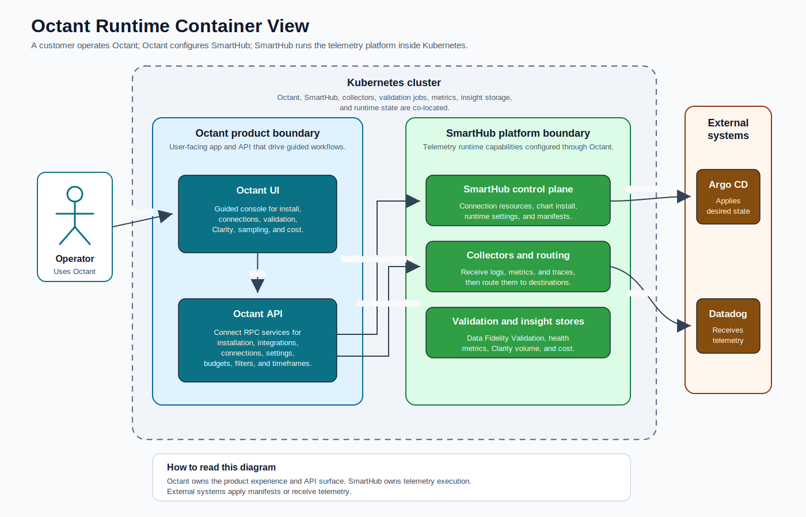
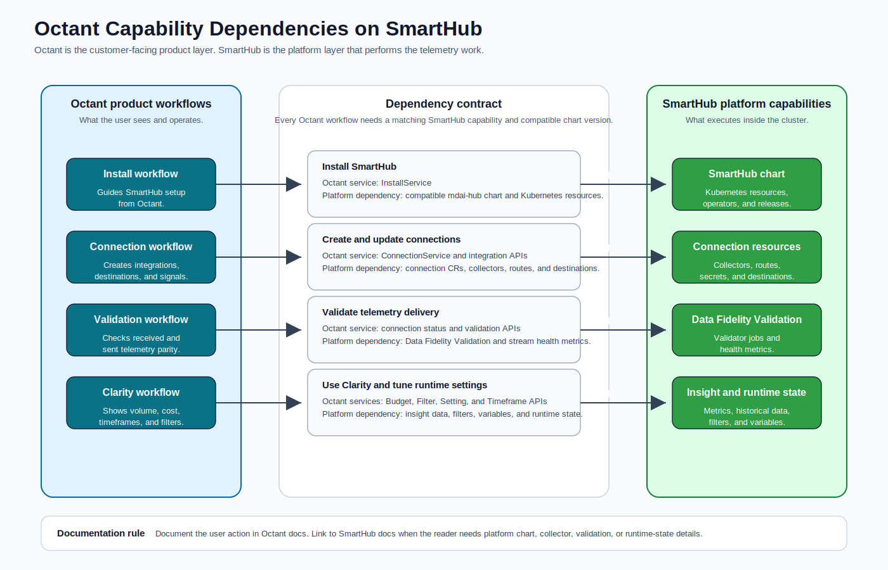

# Octant Architecture

Octant is a web app and API that acts as a visual control plane for SmartHub.

## Octant C4 View

## Octant Dependency on SmartHub

## Product Purpose

Octant provides the product layer over SmartHub:

- Guided UI workflows.
- Connect RPC APIs.
- SmartHub installation orchestration.
- Argo CD and Datadog integrations.
- SmartHub connection creation and manifest generation.
- Connection status and Data Fidelity Validation workflows.
- Runtime setting updates.
- Clarity views over telemetry stream, health, cost, and volume data.

## Separation of Concerns

Octant owns the user-facing control plane experience. SmartHub owns the underlying telemetry platform functionality. Every Octant capability depends on a SmartHub capability underneath it.

| Octant capability | SmartHub dependency |
| --- | --- |
| Install SmartHub | SmartHub helm chart and Kubernetes resources |
| Create connections | Compatible OpenTelemetry collectors and their metrics |
| Validate telemetry | Data Fidelity Validation and Prometheus metrics |
| Show Clarity insights | Prometheus and GreptimeDB insight data |
| Update runtime variables/settings | SmartHub runtime configs |

## Kubernetes Locality

Octant is currently modeled as co-located with SmartHub in the same Kubernetes cluster. The Octant UI and API call in-cluster SmartHub services and read in-cluster Prometheus, GreptimeDB, and Valkey-backed state through the API layer.

<!-- ## SmartHub Version Compatibility

Octant-managed installs and generated Argo CD or Helm manifests must treat the `mdai-hub` chart version as a compatibility input. Before installing or upgrading Octant, confirm that the selected Octant version, SmartHub chart version, and generated deployment configuration are intended to work together.

Some Octant capabilities depend on SmartHub platform behavior delivered by `mdai-hub`, `mdai-operator`, or dependent charts. When a required capability is missing after an install or upgrade, verify chart compatibility before changing connection, destination, or Clarity settings. -->

## Related Pages

- [Octant Documentation](index.md)
- [Setup and Operations](setup.md)
- [Connections and Integrations](connections.md)
- [Telemetry Insights](telemetry.md)
