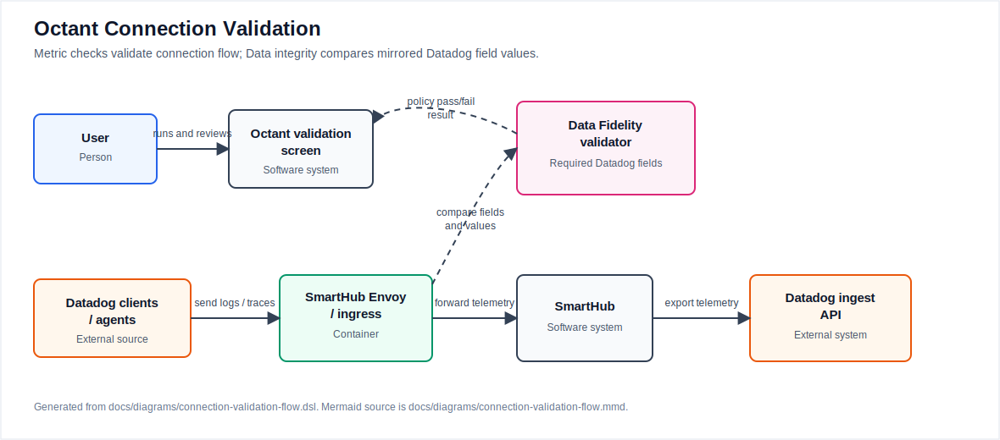

# Understanding Data Connection Failures

Use this guide when you are presented with a failure while setting up a Datadog connection in Octant. The goal is to determine whether the failure is caused by:
1. Client not connected to SmartHub
2. No telemetry entering SmartHub
3. No telemetry leaving SmartHub
4. Data Fidelity Validation policy failure

## How Validation Works

Octant uses two kinds of evidence when it validates a connection:

- **Metric checks**: Clients connected, Receiving data, and Sending data are checked with PromQL queries against SmartHub and OpenTelemetry Collector metrics.
- **Data integrity checks**: the validator uses a mirrored validation pipeline to inspect input and output payload values, confirm required Datadog fields are present, and report policy pass/fail results.

The main telemetry path still sends data to the Datadog ingest API. The mirrored validation path exists so Octant can show whether SmartHub preserved the fields and values Datadog needs for high-fidelity ingestion.



Diagram source: [C4 DSL](../diagrams/connection-validation-flow.dsl). The editable Mermaid sketch is also available for maintainers at [connection-validation-flow.mmd](../diagrams/connection-validation-flow.mmd).

## Start With the Failed Check

Octant validation status is easiest to debug when you map each failed check to the part of the telemetry path it represents.

| Check | What it means | Where to look first |
| --- | --- | --- |
| Clients connected | Datadog clients, agents, or workloads are connected to the SmartHub Envoy/data-plane endpoint. | Datadog Agent endpoint, service DNS, port, network policy, and Envoy downstream/client connection metrics for the connection. |
| Receiving data | The load-balancing collector is accepting telemetry from the Datadog receiver for the selected signal. | `otelcol_receiver_accepted_*` metrics on the load-balancing collector. |
| Sending data | A sampling collector is exporting telemetry to Datadog for the selected signal. | `otelcol_exporter_sent_*` metrics on the log or trace sampling collector with `exporter="datadog"`. |
| Data integrity | The data integrity check does I/O comparison of raw payloads and validates those values against policies to ensure required Datadog fields are present and unchanged for ingestion to the downstream vendor. | Fidelity metrics, validator logs, and the validator result payload for the failed correlation ID. |

Fix checks from left to right. A Data integrity failure is harder to interpret if clients are not connected, the collector is not receiving telemetry, or the sampling collector is not sending telemetry.

## Confirm the Selected Signals

Before looking at Prometheus, confirm which signals were selected in the Octant connection flow.

- Logs should produce log receiver and log exporter metrics.
- Traces should produce span receiver and span exporter metrics.
- Metrics should use the corresponding OpenTelemetry Collector metric-point counters when that signal is configured.

If a signal was not selected when the connection was created, validation for that signal cannot pass until the connection configuration and deployed collectors are updated.

## Check Live Validation Metrics

Open Prometheus for the target cluster and query the validation metrics. In a local environment with Prometheus port-forwarded to `localhost:9090`, the `octant-argo-example` testing guide provides a ready-made [validation metrics dashboard link](http://localhost:9090/graph?g0.expr=mdai_fidelity_attribute_checks_total&g0.tab=0&g0.display_mode=lines&g0.show_exemplars=0&g0.range_input=1h&g1.expr=mdai_fidelity_required_attribute_checks_total&g1.tab=1&g1.display_mode=lines&g1.show_exemplars=0&g1.range_input=1h&g2.expr=mdai_fidelity_signal_checks_total&g2.tab=1&g2.display_mode=lines&g2.show_exemplars=0&g2.range_input=1h&g3.expr=mdai_fidelity_required_signal_checks_total&g3.tab=1&g3.display_mode=lines&g3.show_exemplars=0&g3.range_input=1h&g4.expr=otelcol_receiver_accepted_log_records_total%7Bservice_name%3D%22test-dd-sampling-lb-collector%22%2C%20receiver%3D%22datadog%22%7D&g4.tab=1&g4.display_mode=lines&g4.show_exemplars=0&g4.range_input=1h&g5.expr=otelcol_receiver_accepted_spans_total%7Bservice_name%3D%22test-dd-sampling-lb-collector%22%2C%20receiver%3D%22datadog%22%7D&g5.tab=1&g5.display_mode=lines&g5.show_exemplars=0&g5.range_input=1h&g6.expr=otelcol_exporter_sent_log_records_total%7Bservice_name%3D%22test-dd-log-sampling-collector%22%2Cexporter%3D%22datadog%22%7D&g6.tab=1&g6.display_mode=lines&g6.show_exemplars=0&g6.range_input=1h&g7.expr=otelcol_exporter_sent_spans_total%7Bservice_name%3D%22test-dd-trace-sampling-collector%22%2Cexporter%3D%22datadog%22%7D&g7.tab=1&g7.display_mode=lines&g7.show_exemplars=0&g7.range_input=1h&g8.expr=envoy_server_total_connections&g8.tab=1&g8.display_mode=lines&g8.show_exemplars=0&g8.range_input=1h).

Use these queries as the starting point:

```promql
mdai_fidelity_attribute_checks_total
mdai_fidelity_required_attribute_checks_total
mdai_fidelity_signal_checks_total
mdai_fidelity_required_signal_checks_total
```

These counters help identify whether the validator is failing normal attribute checks, required attribute checks, signal checks, or required signal checks.

For Datadog logs entering SmartHub, check the load balancing collector:

```promql
otelcol_receiver_accepted_log_records_total{service_name="test-dd-sampling-lb-collector", receiver="datadog"}
```
or

For Datadog traces entering SmartHub, check the load balancing collector:

```promql
otelcol_receiver_accepted_spans_total{service_name="test-dd-sampling-lb-collector", receiver="datadog"}
```

For Datadog logs leaving SmartHub, check the load balancing collector:

```promql
otelcol_exporter_sent_log_records_total{service_name="test-dd-log-sampling-collector", exporter="datadog"}
```

For Datadog traces leaving SmartHub, check the trace sampling collector:

```promql
otelcol_exporter_sent_spans_total{service_name="test-dd-trace-sampling-collector", exporter="datadog"}
```

Replace `test-dd` with the connection name Octant generated and adjust the metric family for the selected signal. If receiving data increases but sending data does not, inspect the sampling collector, exporter configuration, Datadog credentials, and collector logs. If neither increases, inspect the Datadog Agent routing and SmartHub ingress endpoint.

## Debug Data Integrity Failures

Data integrity failures mean telemetry is moving far enough for the validator to compare mirrored input and output payloads, but one or more policies did not match the expected fields or signals.

First, list failed validator correlation IDs. Replace `mdai` and `test-dd-telemetry-validation-fidelity-validator` with the namespace and validator service for the target connection.

```shell
kubectl logs -n mdai svc/test-dd-telemetry-validation-fidelity-validator --since=20s \
  | grep -E '"policy_pass":false' \
  | grep -o '"correlation_id":"[^"]*"' \
  | cut -d'"' -f4 \
  | sort -u
```

If no IDs are returned, widen `--since` or rerun validation so the validator emits fresh result logs.

Next, port-forward the validator service:

```shell
kubectl -n mdai port-forward svc/test-dd-telemetry-validation-fidelity-validator 8080:8080
```

Open the result for one failed correlation ID:

```text
http://localhost:8080/results/<correlation_id>
```

The result payload shows the comparison that failed. Use it to identify the policy, signal, missing required attribute, mismatched attribute value, or unexpected payload shape.

## Common Causes

| Symptom | Likely cause | What to change |
| --- | --- | --- |
| Clients connected is failing | Datadog Agent or workload is still sending directly to Datadog or to the wrong SmartHub endpoint. | Update the Datadog Agent endpoint, service name, port, namespace, or network policy. |
| Receiving data is failing | The load-balancing collector is not accepting the selected signal. | Confirm the signal was selected, the Datadog receiver is enabled, and the source is sending logs or traces to SmartHub. |
| Sending data is failing | Sampling collector cannot export to Datadog or the selected signal is not routed to the expected collector. | Check Datadog destination settings, secret references, exporter errors, collector readiness, and signal routing. |
| Data integrity fails but telemetry is flowing | Required fields are missing or transformed differently than the policy expects. | Compare the validator result payload against the policy and update the source attributes, transforms, or policy expectations. |
| A fresh validation run fails intermittently | Metrics or validator results may lag while telemetry is still moving through the system. | Wait for counters to populate, rerun validation, then debug persistent failures with correlation IDs. |

## Rerun Validation

After fixing routing, credentials, signal selection, transforms, or policy configuration:

1. Let the changed collectors roll out and become ready.
2. Confirm clients are connected.
3. Confirm receiver counters increase for the selected signal.
4. Confirm Datadog exporter counters increase for the selected signal.
5. Rerun Data Fidelity Validation in Octant.
6. If Data integrity still fails, inspect a new failed correlation ID and compare the validator result against the policy.

## Related Pages

- [Connections and Integrations](../connections.md)
- [Telemetry Insights](../telemetry.md)
- [Setup and Operations](../setup.md)
- [Deploy SmartHub to Production](production.md)
- [Commit SmartHub Configuration to Source Control](gitops.md)
