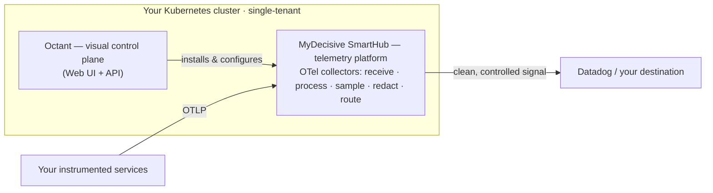

# Octant — Product Primer

**The control plane for your observability pipeline.** Build powerful, cost-controlled OpenTelemetry pipelines in minutes — not months.

> **What this is — and isn't.** A ~5-minute explainer for developers, SREs, and platform engineers: what Octant is, why you'd want it, and how it works with the MyDecisive SmartHub. It is **not** a production deployment guide, a deep architecture reference, or a course on extracting every capability from the platform. When you're done you'll understand the pieces and be ready to spin up a development environment on your laptop. Links throughout go deeper so this stays short.

## What is Octant?

Octant is a web-based **visual control plane** for your telemetry pipeline. Building a robust OpenTelemetry pipeline normally means months of education, configuration, and testing. Octant turns that into minutes of guided, visual workflows — it generates valid OpenTelemetry pipelines and Kubernetes configuration for you.

If you know Ubiquiti's Unifi, the analogy is exact: Unifi makes enterprise-grade networks simple to build and run. **Octant does the same for observability pipelines** — the power, without needing to be a pipeline engineer.

From Octant you:

- **Install & connect** — stand up the SmartHub and its collectors, then create connections that define your namespace, enabled signals, deployment method, and destination (e.g. Datadog), and save integrations like Argo CD.
- **Tune signal with Clarity** — see real-time volume and cost, and adjust filtering and sampling per service, per resource, and per signal type: keep what matters, drop the noise, cut the bill.
- **Validate** — confirm telemetry is actually flowing, complete, and correct (Data Fidelity Validation).
- **Operate** — update runtime settings such as enabled signals, credentials, and sampling filters.

These ship as **applets** — discrete modules you manage from Octant. Install, Connect, and Clarity are available today, with more on the roadmap.

## What is the SmartHub?

Octant is the control plane; the **MyDecisive SmartHub** is the platform it controls. The SmartHub is the **Kubernetes-native telemetry platform** — the OpenTelemetry collector foundation that receives, processes, samples, and routes your logs, metrics, and traces, plus the services that manage it.

Because it runs **on the wire, inside your own cluster**, the SmartHub controls your telemetry before it reaches (and bills against) your observability vendor: it cuts cost and volume in real time, redacts PII at the source for data sovereignty, validates telemetry fidelity, and can run closed-loop automation against your live stream. It does the actual work on your telemetry; Octant is how you set it up and operate it.

> The SmartHub can also be driven directly (via `mdai-cli` or Kubernetes manifests) — Octant is the guided, visual path most teams will want. Its companion is the **[SmartHub primer](https://github.com/MyDecisive/mdai-hub)**.

## How Octant and the SmartHub work together

Two planes, one cluster:
- **Octant — the visual control plane.** The web app and API where you install, configure, validate, and tune your pipeline.
- **SmartHub — the platform.** The runtime that runs the OpenTelemetry Collectors and platform services: it receives, processes, samples, redacts, and routes your telemetry.

Octant and the SmartHub are **co-located in the same Kubernetes cluster.** Octant orchestrates the SmartHub's install, generates the pipeline and Kubernetes configuration, and reads stream, health, cost, and volume state directly from the in-cluster platform. The SmartHub does the heavy lifting. Every Octant capability depends on a SmartHub capability underneath it.



*Your services send telemetry (OTLP) into the SmartHub's collectors; the SmartHub controls it and forwards only what matters downstream. Octant is how you drive all of it.*

## Where it goes in your infrastructure

Both Octant and the SmartHub run **inside your own Kubernetes cluster**, single-tenant and dedicated to your traffic — the SmartHub processes your telemetry in your environment before anything is forwarded on. The SmartHub sits **in-line** between your instrumented services and your downstream observability vendor: services send signal in through OpenTelemetry Collectors, the SmartHub processes and routes it, and your vendor (e.g. Datadog) receives the controlled stream. Octant lives alongside as the control plane.

## What to expect once it's installed

- A **working OpenTelemetry pipeline in minutes** — generated and validated for you, not hand-built.
- **Real-time control** over what flows: filter and sample by service, resource, and signal type.
- **Cost and volume visibility** through Clarity — see, and cut, what you send downstream.
- **Confidence it's correct**: Data Fidelity Validation confirms telemetry is flowing and complete to your destination.
- A **foundation to build on** as you adopt more of the platform's capabilities.

What this doc *won't* give you is production hardening, sizing, and day-2 detail — that's in the installation and architecture guides.

## Get started — run it

The fastest way to understand Octant is to run it. Spin up the local development environment on your laptop:

```shell
git clone https://github.com/MyDecisive/octant-argo-example.git
cd octant-argo-example
just prereqs
just octant-bootstrap
just port-forward-octant        # then open http://localhost:5678/
```

That bootstraps a local Octant against Argo CD and walks you into the SmartHub install and connection workflows. Full prerequisites are in the [Octant Quick Start](https://github.com/MyDecisive/octant) and the [installation guide](https://github.com/MyDecisive/octant/blob/main/docs/installation.md).

## Dive deeper

<!-- PRE-LAUNCH: confirm/swap public URLs below before publishing. -->

- **Octant — source & docs:** [github.com/MyDecisive/octant](https://github.com/MyDecisive/octant)
- **Octant development environment:** [github.com/MyDecisive/octant-argo-example](https://github.com/MyDecisive/octant-argo-example)
- **SmartHub & platform docs:** [docs.mydecisive.ai](https://docs.mydecisive.ai/)
- **SmartHub — source & primer:** [github.com/MyDecisive/mdai-hub](https://github.com/MyDecisive/mdai-hub)

---

<sub>MyDecisive · Octant + SmartHub. This is an explainer, not a deployment or architecture guide — see the links above to go deeper.</sub>
